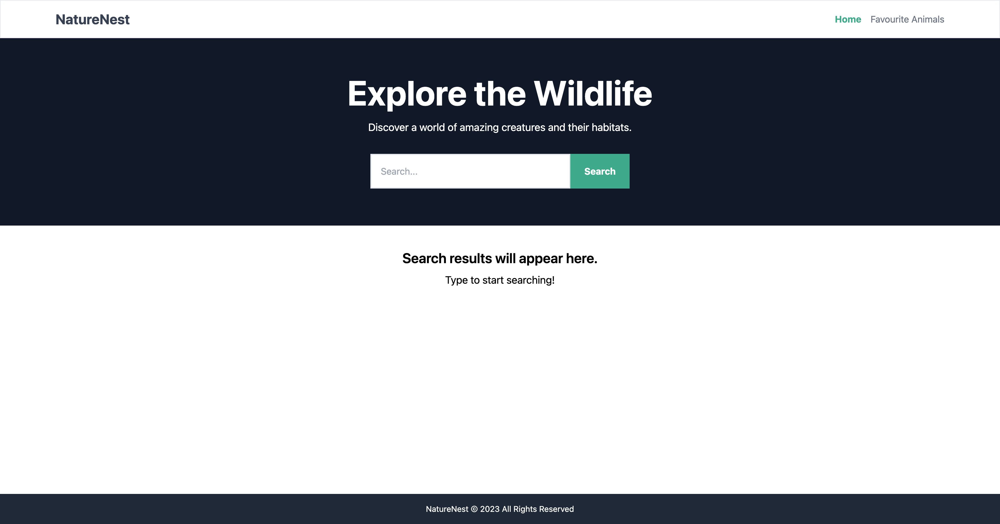
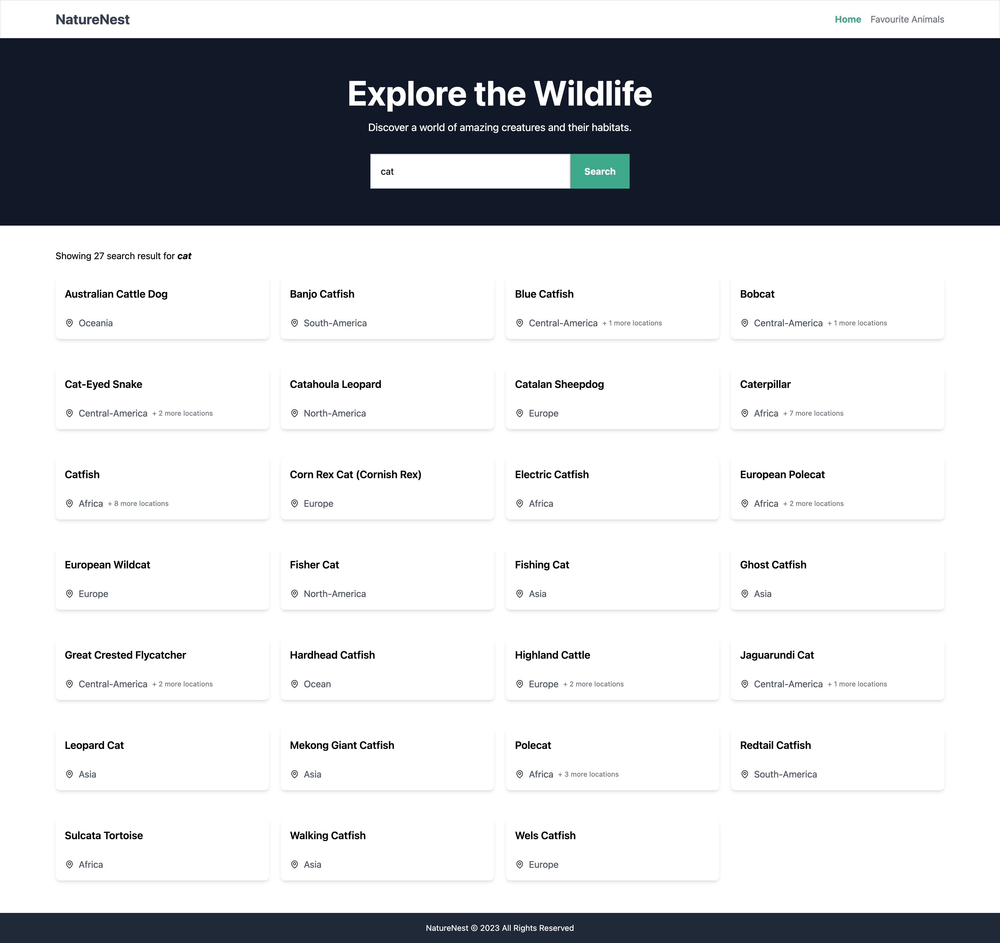
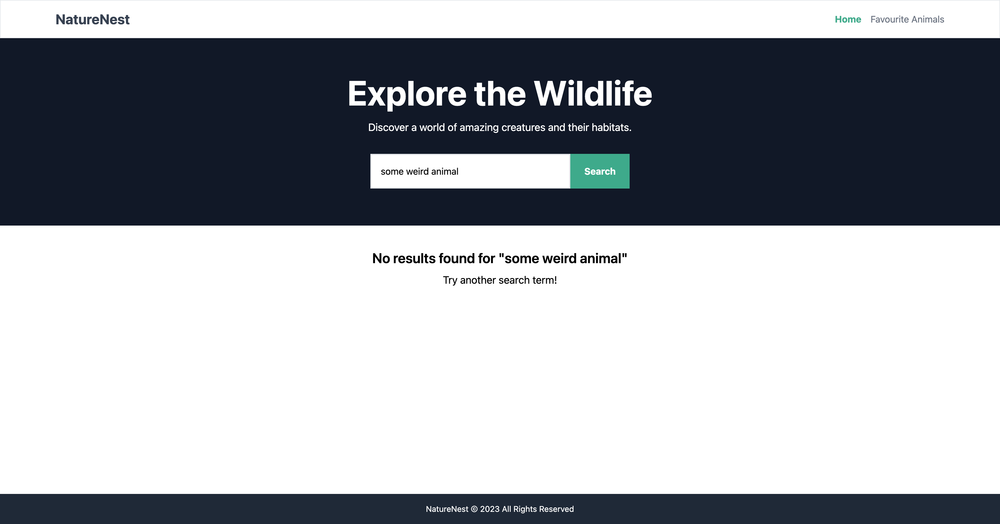
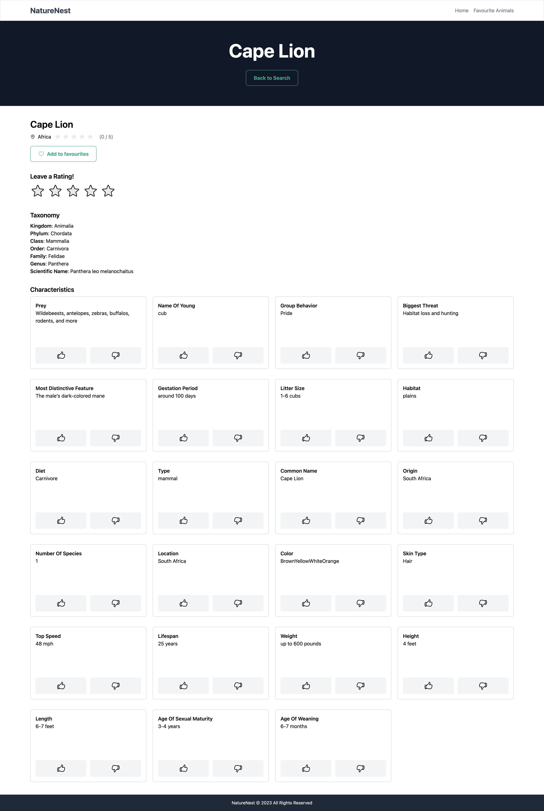
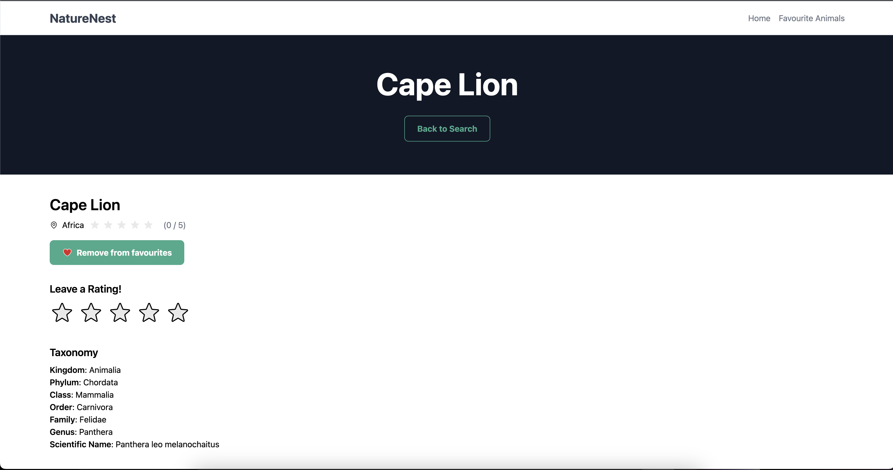
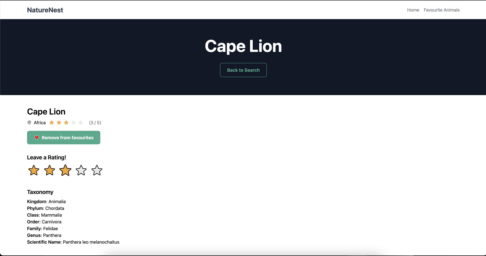
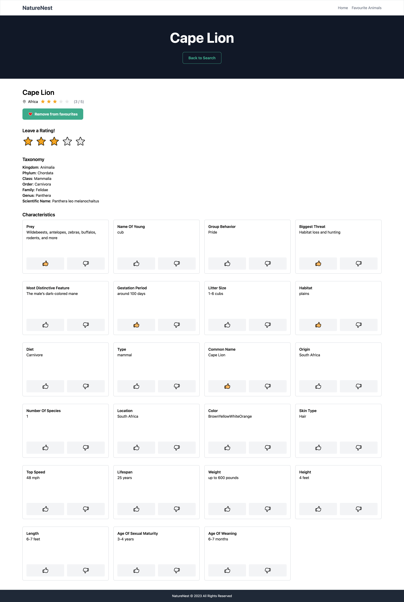
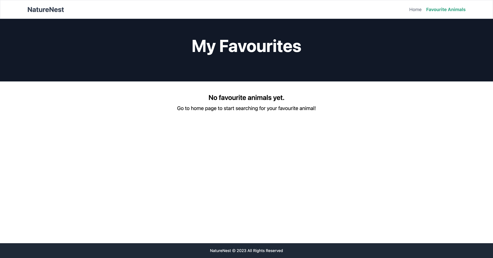
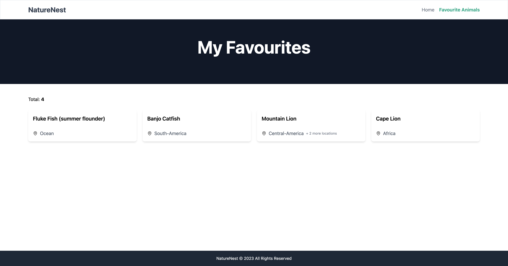
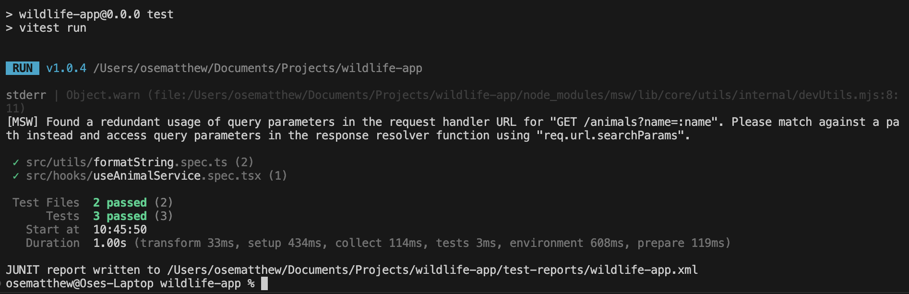

# Wildlife App - NatureNest

### Background

Welcome to NatureNest, a miniature project enabling users to explore and learn about various animals. NatureNest enables users to search for animals, view detailed information, create a favorites list, and express preferences by liking or disliking animals. Utilizing local storage, NatureNest ensures data persistence without a backend infrastructure.

### Technical Background

This project integrates the persistQueryClient plugin from React Query for fetching and storing data in local storage. For more details, refer to the documentation on persistent storage [HERE](https://tanstack.com/query/v5/docs/react/plugins/persistQueryClient). The configuration of this plugin is found in main.tsx

When searching for animals on the home page, the search term serves as a query key for the search results. This approach ensures that when the same search term is used again, the data is fetched from the cache (local storage). Clicking on an animal within the displayed search results navigates the user to the animal details page. On this page, the actual name of the animal is used as a query key. This methodology ensures that upon revisiting the page, the data is loaded from the cache. It's important to note that with each new key, an API call is made and the results are saved to the cache.

To manage adding animals to favorites, a boolean property named `isFavourite` is introduced in the cache, where name is equals name of animal (recall that the name is used as the cache key). Similarly, rating an animal involves the addition of a numeric property named `rating` in the cache, where the name matches the animal's name.

Regarding liking and disliking animals, an object called `preferences` is included in the cache. This object contains characteristic key names associated with values indicating 'like' or 'dislike' for the corresponding animal's name.

To view all selected favorites, the entire cache is examined to identify animals where the `isFavourite` property is set to `true`. This data is then extracted and formatted for display in the user interface.


## Requirements

- [Node.js](https://nodejs.org/en/download/package-manager) ^20.8.1


## Libraries/Dependencies

- React
- Typescript
- Tailwind CSS - for implementing designs.
- React Query - for data fectching with caching

- Husky - for precommit and prepush hooks. Used to run scripts before commiting or pushing to repo
- Vitest
- Resct Testing Library
- Jest dom
- Cypress for e2e


## Environment Variables

The following environment variables are needed to run the app successfully.

```sh
VITE_API_NINJA_KEY= ## Api key gotten from https://api-ninjas.com/api/animals 
```


## How to run

```bash
# install deps
$ npm i

# development mode
$ npm run dev

# production mode
$ npm build
$ npm preview ## preview the production build
```


## Tests

```bash
# unit tests
$ npm run test

# e2e tests
$ npm run e2e
```


## Features

1. Search: This app offers a user-friendly interface allowing users to explore information about various animals. The search functionality is accessible on the home page of the app, illustrated in the accompanying screenshot. Users input their desired search term into the provided text field, and upon clicking the search button, a request is triggered to the 'api-ninjas' API. Subsequently, the retrieved results are showcased on the screen, corresponding to the search query. Additionally, the application adeptly handles scenarios where no results are found, ensuring a seamless user experience.










2. Animal Details View: Following a search and the presentation of search results, clicking on an animal redirects users to a dedicated page showcasing detailed information about that specific animal. Referencing the provided screenshot below, this page offers an in-depth exploration of the selected animal's characteristics and details




3. Adding Animals to favourites: From the details view, users can add animals to their favorites list. A simple click on the button adds the selected animal to the favorites list, as illustrated in the accompanying screenshot.




4. Rating Animals: In the details view, users can assign a rating to animals using the large rating icon in the 'Leave your rating' section. This allows users to rate the animal on a scale of 1 to 5.




5. Like/Dislike Animal Characteristics: In the details view, users can also like and dislike animal characteristics




6. View Favorites: Users can navigate to the Favorites Animals page and view all the animals they have previously selected as favorites. If no favorites have been selected yet, a message will be displayed o the page prompting the user to search and select their favorite animals.






7. Testing: Although there wasn't enough time to implement proper test, the following test were implemented:

- **E2E test**: basic e2e test was implemented to perform search and adding animals to favourites.


- **Unit test**: Very basic unit test was implemented for some functions. Some where not comnpleted due to time constraints.




## Improvements

